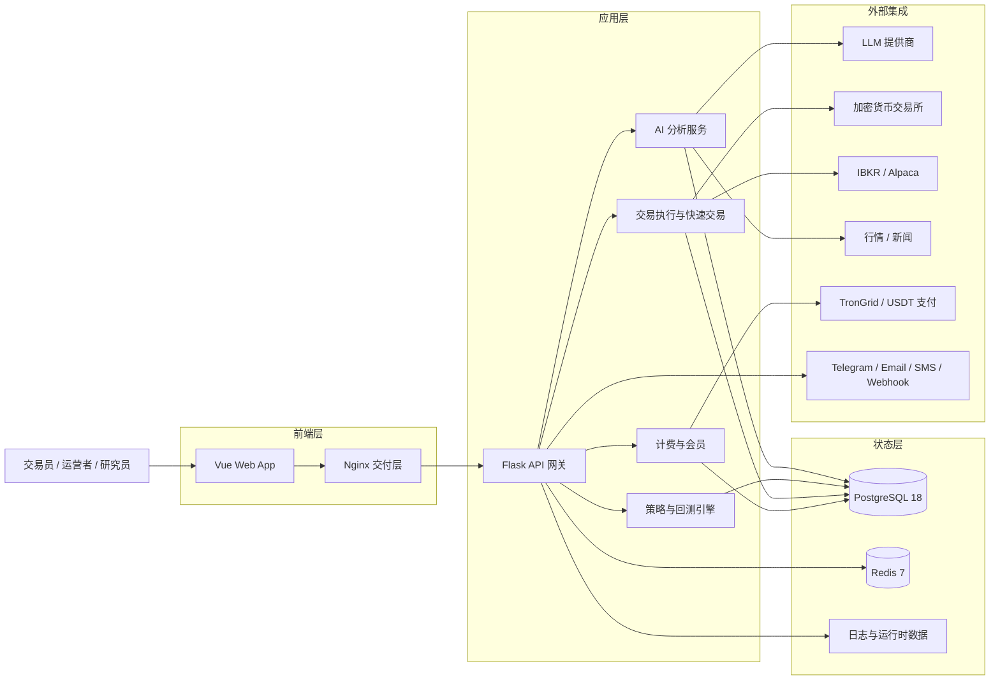

<div align="center">
  <a href="https://github.com/brokermr810/QuantDinger">
    
  </a>

  <h1>QuantDinger</h1>
  <h3>开源 AI Trading OS，面向自动化交易</h3>
  <p><strong>从交易想法到 Python 策略、回测、模拟盘、实盘执行和监控，一套自托管系统全部跑通。</strong></p>
  <p><strong>QuantDinger 是 Open Byte Inc 的产品。</strong></p>
  <p><em>AI 研究 → 策略开发 → 回测验证 → 模拟/实盘执行 → 风险监控</em></p>

  <div align="center" style="max-width: 680px; margin: 1.25rem auto 0; padding: 20px 22px 22px; border: 1px solid #d1d9e0; border-radius: 16px;">
    <p style="margin: 0 0 14px; line-height: 1.65;">
      <a href="../README.md"><strong>English</strong></a>
      <span style="color: #afb8c1;"> / </span>
      <a href="README_CN.md"><strong>Chinese</strong></a>
    </p>
    <p style="margin: 0 0 18px; padding-bottom: 16px; border-bottom: 1px solid #eaeef2; line-height: 2;">
      <a href="https://ai.quantdinger.com"><strong>SaaS</strong></a>
      <span style="color: #d8dee4;"> &nbsp;·&nbsp; </span>
      <a href="api/README.md"><strong>API 文档</strong></a>
      <span style="color: #d8dee4;"> &nbsp;·&nbsp; </span>
      <a href="https://www.youtube.com/watch?v=tNAZ9uMiUUw"><strong>视频演示</strong></a>
      <span style="color: #d8dee4;"> &nbsp;·&nbsp; </span>
      <a href="https://www.quantdinger.com"><strong>官网</strong></a>
    </p>
    <p style="margin: 0; line-height: 2;">
      <a href="https://t.me/quantdinger"></a>
      &nbsp;
      <a href="https://discord.com/invite/tyx5B6TChr"></a>
      &nbsp;
      <a href="https://youtube.com/@quantdinger"></a>
      &nbsp;
      <a href="https://x.com/QuantDinger_EN"></a>
    </p>
  </div>

  <p style="margin-top: 1.45rem; margin-bottom: 10px;">
    <a href="../LICENSE"></a>
    
    
    
    
    
    
    
  </p>
</div>

---

## 目录

[两分钟跑起来](#两分钟跑起来) · [为什么选择 QuantDinger](#为什么选择-quantdinger) · [安全模型](#安全模型) · [技术亮点](#技术亮点) · [相关仓库](#相关仓库) · [MCP 与 Agent 网关](#mcp-agent-gateway) · [产品概览](#产品概览) · [功能一览](#功能一览) · [架构](#架构) · [安装](#安装与首次运行) · [文档](#文档导航) · [常见问题](#常见问题) · [许可](#许可与商业说明)

---

## 两分钟跑起来

> **最快方式：一行命令。** 不用 `git clone`，不用 `npm`，也不用准备 Vue 源码。安装器会拉取 GHCR 预构建镜像，并在首次启动时生成安全密钥。

**前置条件：** [Docker](https://docs.docker.com/get-docker/) + Compose v2（Windows/macOS 用 Docker Desktop）。**不需要 Node.js**。

```bash
curl -fsSL https://raw.githubusercontent.com/brokermr810/QuantDinger/main/install.sh | bash
```

Windows PowerShell：

```powershell
irm https://raw.githubusercontent.com/brokermr810/QuantDinger/main/install.ps1 | iex
```

默认安装位置：Linux/macOS 为 `~/quantdinger`，Windows 为 `$HOME\quantdinger`。Linux/macOS 可用 `... | bash -s -- /opt/quantdinger` 指定目录；Windows 可在执行一行命令前设置 `$env:QUANTDINGER_INSTALL_DIR="C:\QuantDinger"`。

启动后打开 **`http://localhost:8888`**，用安装时填写的管理员账号和密码登录。移动端 H5 同时运行在 **`http://localhost:8889`**。

<details>
<summary><b>Windows、手动克隆和镜像加速</b></summary>

**Windows（PowerShell）**：手动克隆后进入 **`QuantDinger`** 目录：

```powershell
git clone https://github.com/brokermr810/QuantDinger.git
Set-Location QuantDinger
Copy-Item backend_api_python\env.example -Destination backend_api_python\.env
$key = & python -c "import secrets; print(secrets.token_hex(32))" 2>$null
if (-not $key) { $key = & py -c "import secrets; print(secrets.token_hex(32))" 2>$null }
(Get-Content backend_api_python\.env) -replace '^SECRET_KEY=.*$', "SECRET_KEY=$key" | Set-Content backend_api_python\.env -Encoding utf8
docker compose pull
docker compose up -d
```

**标准克隆（macOS / Linux）：**

```bash
git clone https://github.com/brokermr810/QuantDinger.git && cd QuantDinger && cp backend_api_python/env.example backend_api_python/.env && chmod +x scripts/generate-secret-key.sh && ./scripts/generate-secret-key.sh && docker compose pull && docker compose up -d
```

**`docker pull` 很慢或经常失败：** 可以在仓库根目录 `.env` 增加 `IMAGE_PREFIX=docker.m.daocloud.io/library/`，也可以在 **Docker Desktop → Proxies** 里配置代理。

</details>

更完整的安装步骤见 **[安装与首次运行](#安装与首次运行)**；遇到 Docker 拉镜像、代理或 Postgres 启动问题，可看 **[安装排错指南](INSTALL_TROUBLESHOOTING.md)**。

---

## 为什么选择 QuantDinger

| 传统做法 | QuantDinger |
|----------|-------------|
| ChatGPT 只能生成代码 | 策略可以在同一套系统里运行、回测、执行和监控 |
| TradingView、Jupyter、交易所 bot 分散在各处 | 从研究到执行，一套自托管系统串起来 |
| SaaS 平台托管你的 API 密钥 | 自己部署，基础设施和密钥都掌握在自己手里 |
| AI Agent 权限不清、过程不可追踪 | Agent Gateway 支持权限范围控制，默认模拟盘交易，并保留审计日志 |

QuantDinger 是一个**可自托管、本地优先**的 AI Trading OS / AI 自动化交易系统。它不是“聊天框里加一个买入按钮”，而是把 **多 LLM 研究**、**Python 策略引擎**、**服务端回测**、**自动化执行** 和 **多券商实盘运营** 放在同一套生产级系统里。加密货币交易所、IBKR、Alpaca 等执行链路都由你自己的部署掌控。

## 安全模型

- **Agent token 默认只能模拟盘交易**：实盘必须由服务端显式开启。
- **实盘执行需要双重授权**：token 权限范围和自托管服务端的 `AGENT_LIVE_TRADING_ENABLED` 都要满足。
- **交易所密钥留在你自己的部署里**：自托管版本不会把密钥交给 QuantDinger SaaS 运营方。
- **Agent 调用都会写入审计日志**：方便之后复盘、排查和做合规审查。
- **QuantDinger 不提供投资建议**：软件只用于合法研究和交易执行，合规与风险由使用者自行承担。

## API 文档

| 资源 | 链接 |
|------|------|
| Web API（OpenAPI） | [`api/openapi.yaml`](api/openapi.yaml) |
| ReDoc 浏览（需 HTTP 服务） | [`api/index.html`](api/index.html) —— 在 `docs/api/` 下运行 `python -m http.server` |
| 约定（认证、响应封装） | [`API_CONVENTIONS.md`](API_CONVENTIONS.md) |
| Agent Gateway | [`agent/agent-openapi.json`](agent/agent-openapi.json) |

---

<div align="center">
  
  <p><sub><em>几分钟跑通：图表、AI 分析、策略开发和回测流程。</em></sub></p>
</div>

<div align="center">
  
  <p><sub><em>闭环流程：<strong>AI 研究 → 策略开发 → 回测验证 → 模拟/实盘执行 → 风险监控</strong>。</em></sub></p>
</div>

## 技术亮点

| | QuantDinger 的差异化 |
|---|---------------------|
| **完整的 AI Trading OS** | 图表、指标 IDE、AI 分析、回测、实盘机器人、快速交易、券商账户管理都在同一套系统里，共用一个 Postgres 状态库。 |
| **面向 Agent 设计** | 内置 **Agent Gateway**（`/api/agent/v1`）和 PyPI 上的 **[`quantdinger-mcp`](https://pypi.org/project/quantdinger-mcp/)**。Cursor、Claude Code、Codex 可以读行情、跑回测、管理策略，并按默认模拟盘规则下单。 |
| **两种策略运行方式** | **`IndicatorStrategy`** 适合 dataframe 信号和图表叠加；**`ScriptStrategy`** 适合事件驱动、显式下单和更贴近实盘的逻辑。研究和执行可以复用同一套 Python 体系。 |
| **多市场执行链路** | 直接适配 Binance、OKX、Bitget、Bybit、Gate、HTX、Coinbase Exchange、Kraken、**IBKR**、**Alpaca** 等平台，并提供统一的券商账户管理和多租户会话隔离。 |
| **生产级部署基础** | **PostgreSQL 18** + **Redis 7**、连接池、后台 Worker、幂等 schema 初始化、GHCR 多架构镜像（amd64/arm64），适合长期运行。 |
| **默认安全收紧** | 拒绝默认 `SECRET_KEY`，Agent token 哈希存储，交易类 token 默认只能模拟盘交易，实盘必须在服务端显式打开，并保留完整审计日志。 |
| **适合二次商业化** | OAuth、多用户角色、积分/会员/USDT 计费开关、11 语种 Web UI 和多语言文档都已预留，可以在此基础上搭建自己的 AI 交易产品。 |

<details>
<summary><b>更多安装方式（仅 GHCR、构建说明）</b></summary>

**最轻——两个文件（无需 `git clone`）：**

```bash
curl -O https://raw.githubusercontent.com/brokermr810/QuantDinger/main/docker-compose.ghcr.yml
curl -o backend.env https://raw.githubusercontent.com/brokermr810/QuantDinger/main/backend_api_python/env.example
docker compose -f docker-compose.ghcr.yml pull
docker compose -f docker-compose.ghcr.yml up -d
```

**日常安装不需要 `docker compose up --build`**：主 compose 文件只会从本地源码构建后端，Web 和移动端 UI 会直接拉 GHCR 镜像。只有改了后端代码，才需要 `docker compose up -d --build backend`。如果要从 UI 源码构建，请使用 `docker-compose.build.yml`（见 [安装与首次运行](#安装与首次运行)）。

</details>

## 相关仓库

本仓库包含 **后端源码**、**Docker Compose 部署文件** 和 **文档**。Web 前端与移动端 H5 的镜像由兄弟仓库单独构建并发布到 GHCR；如果要改 UI 源码或构建原生移动端，需要配合下面的仓库：

| 仓库 | 说明 |
|------|------|
| **[QuantDinger](https://github.com/brokermr810/QuantDinger)**（本仓库） | 后端（Flask/Python）、Compose 部署栈、文档 |
| **[QuantDinger-Vue](https://github.com/brokermr810/QuantDinger-Vue)** | **Web 前端源码**（Vue）—— 打 `v*` tag 即自动构建并推送 `ghcr.io/brokermr810/quantdinger-frontend` |
| **[QuantDinger-Mobile](https://github.com/brokermr810/QuantDinger-Mobile)** | **移动端 + H5 客户端**；Compose 默认在 `http://localhost:8889` 提供 H5 |

**说明：** 默认 Docker 安装会直接拉取已发布镜像，不需要 Node.js。只有你要从源码构建 Web 或移动端 H5 时才需要 Node。源码开发建议统一使用 **Node 22 LTS**；移动端 H5 仓库要求 Node **20.19+ 或 22.12+**（Vite 7），PC 前端也可以运行在 Node 22。

<h2 id="mcp-agent-gateway">用 AI Agent 接入（Cursor / Claude Code / Codex / MCP）</h2>

QuantDinger 内置 **Agent Gateway**（`/api/agent/v1`），并提供已发布到 PyPI 的轻量 **MCP 服务器**（[`quantdinger-mcp`](https://pypi.org/project/quantdinger-mcp/)）。你只需要签发一个 token，AI 客户端就可以读取行情、跑回测、管理策略，并按默认模拟盘规则下单。整个过程中，AI 客户端**不会接触你的交易所密钥或管理员 JWT**。

> 两条安全底线：每次 Agent 调用都会**写入审计日志**；交易类 token **默认只能模拟盘交易**。只有服务端 `AGENT_LIVE_TRADING_ENABLED=true`，并且 token 上 `paper_only=false`，才允许实盘执行。

无论使用 SaaS 还是自托管，客户端配置方式都一样，只是 `QUANTDINGER_BASE_URL` 不同：

- **云端版（30 秒上手）**：在 [ai.quantdinger.com](https://ai.quantdinger.com) 注册后，进入 **个人中心 → 我的 Agent Token** 签发 token。支持 **T（交易）权限**，但默认仍然只允许模拟盘交易；实盘需要 token 上 `paper_only=false`、签发时确认风险，并且服务器开启 `AGENT_LIVE_TRADING_ENABLED=true`。
- **自托管版（本仓库）**：按上面的 [两分钟跑起来](#两分钟跑起来) 启动后，进入 **个人中心 → 我的 Agent Token** 签发 token。管理员也可以通过 `/agent-tokens` 做全站审计。权限范围、白名单、速率限制和实盘开关都由你自己控制。

然后把下面的 JSON 写入 Cursor / Claude Code / Codex 的 MCP 配置文件（`.cursor/mcp.json` 模板见 [`docs/agent/cursor-mcp.example.json`](agent/cursor-mcp.example.json)）：

```json
{ "mcpServers": { "quantdinger": {
  "command": "uvx", "args": ["quantdinger-mcp"],
  "env": { "QUANTDINGER_BASE_URL": "http://localhost:8888",
           "QUANTDINGER_AGENT_TOKEN": "qd_agent_xxxxxxxx" }
} } }
```

完整接入方式，包括本地 stdio、远程 HTTP 传输、Claude Code 命令行、Agent 提示词样例和审计日志说明，都在：**[`docs/agent/MCP_SETUP.md`](agent/MCP_SETUP.md)**。

更深入：[AI 集成设计](agent/AI_INTEGRATION_DESIGN.md) · [`curl` 快速开始](agent/AGENT_QUICKSTART.md) · [OpenAPI 3.0 契约](agent/agent-openapi.json) · [MCP 服务器 README](../mcp_server/README.md)

## 产品概览

**适合谁：** 独立交易者、Python 策略作者、自营或小团队，以及想在私有基础设施上搭建白标 AI 交易产品的运营方。不需要把交易所 API 密钥交给黑盒 SaaS。

## 功能一览

- **研究与 AI**：多 LLM 协同分析、自选列表、机会雷达、自然语言生成指标/策略、回测后的 AI 复盘提示，也可以开启置信度校准。**[Agent 网关 + MCP](#mcp-agent-gateway)** 可接入 Cursor、Claude Code、Codex，并支持带权限范围的 token 和 SSE 任务流。
- **策略开发**：内置专业 K 线图表；支持 `IndicatorStrategy`（四向 dataframe 信号：`open_long`、`close_long`、`open_short`、`close_short`）和 `ScriptStrategy`（`on_bar`、`ctx.buy()` / `ctx.sell()`）。AI 可以生成初稿，但最终策略仍是可审查、可修改的 Python 代码。
- **回测验证**：回测在服务端执行，输出资金曲线、回撤指标、成交日志和策略快照，不是只在前端做展示的“假回测”。
- **实盘运营**：支持实盘策略机器人、快速交易、加密货币现货/合约交易所适配器，以及 **IBKR** / **Alpaca** 传统市场工作流；统一经纪商账户页，并支持 Telegram、邮件、短信、Discord、Webhook 通知。
- **部署与平台能力**：Docker Compose + GHCR 镜像、PostgreSQL 18、Redis 7、OAuth、多用户 RBAC、积分/会员/USDT 计费开关、11 语种 Web UI 和多语言文档。

## 架构

**设计原则：** **行情采集**、**策略/回测计算**、**订单执行** 分层解耦。只有当你明确把策略切到实盘，研究流程才会进入真实资金链路。

**栈结构：** Nginx 提供预构建 Vue SPA（`ghcr.io/brokermr810/quantdinger-frontend`）；**Flask + Gunicorn** 承载策略、AI、计费与 Agent API；**PostgreSQL 18** 保存系统状态；**Redis 7** 负责缓存和 Worker 协调。交易所、经纪商、LLM、支付等外部服务都通过 env 配置接入，换供应商不需要 fork 核心代码。

**运行时流程：** 行情进入系统后，经过指标/信号层和策略引擎，再进入回测或实盘运行时，最后由对应交易场所的执行适配器处理订单。后台 Worker 会负责挂单派发、健康检查和重试。

**部署方式：** 可以用一行 `install.sh` 快速安装，也可以用零仓库 GHCR Compose 部署，或克隆完整仓库后本地构建后端；想先体验也可以直接使用 [ai.quantdinger.com](https://ai.quantdinger.com)。

### 系统架构图



## 安装与首次运行

> **已经按 [两分钟跑起来](#两分钟跑起来) 启动成功了？** 可以跳过本节。下面只是把同一套流程拆开讲，方便首次部署或想了解配置细节的人查看。

下面按常见本地部署顺序展开：**准备环境 → 拉代码 → 配密钥 → 启动服务 → 自检 → 加固 → 可选接入大模型**。**不需要 Node.js**：`frontend` 和 `mobile` 服务会直接从 GHCR 拉取镜像，由 Nginx 提供 Web 与 H5 应用，无需本地构建。

### 环境准备

| 项目 | 说明 |
|------|------|
| [Docker](https://docs.docker.com/get-docker/) + Compose v2 | 用来启动 Postgres、Redis、后端 API、Web 和移动端 H5。 |
| `git` | 克隆本仓库。 |
| 默认端口 | `8888`（PC Web）、`8889`（移动端 H5）、`5000`（API，默认绑定 **127.0.0.1**）、`5432` / `6379`（数据库与 Redis，默认回环）。若冲突可在**仓库根目录** `.env` 中按 `docker-compose.yml` 调整。 |
| 磁盘 | 数据库会随着用户、策略、回测和日志增长，正式使用建议至少预留数 GB。 |

### 1）克隆仓库

```bash
git clone https://github.com/brokermr810/QuantDinger.git
cd QuantDinger
```

### 2）创建后端配置（必做）

```bash
cp backend_api_python/env.example backend_api_python/.env
```

管理员账号、LLM、后台任务、计费、券商接入等应用配置，主要都在 **`backend_api_python/.env`** 里。

**仓库根目录**下的 `.env` 是给 Docker Compose 用的：端口、镜像源 `IMAGE_PREFIX`、镜像 tag、Postgres 镜像版本、数据目录挂载、`PGDATA`，以及 Compose 生成的 `DATABASE_URL` 都放这里。建议把两个 `.env` 的边界分清：

| 文件 | 负责内容 |
|------|----------|
| `backend_api_python/.env` 或 `backend.env` | 应用自己的运行配置，例如管理员、LLM、交易所、券商、计费等。 |
| 仓库根目录 `.env` | Docker Compose 的部署配置，例如端口、镜像、Postgres/Redis 连接和宿主机路径。 |

### 3）首次启动前必须设置 `SECRET_KEY`

如果 `SECRET_KEY` 仍然是 `env.example` 里的默认占位值，**后端会拒绝启动**。这是为了避免把不安全的默认密钥误部署到公网。

**Linux / macOS（推荐）：**

```bash
./scripts/generate-secret-key.sh
```

脚本会用 Python `secrets` 生成随机值，并写入 `backend_api_python/.env` 的 `SECRET_KEY=`。

**任意系统**：也可以自己生成足够长的随机字符串（例如 64 位十六进制），手动写入 `backend_api_python/.env` 的 `SECRET_KEY=`。

### 4）启动

```bash
docker compose pull
docker compose up -d
```

- **`frontend`**：拉取 `ghcr.io/brokermr810/quantdinger-frontend:latest`，不需要本地 Vue 目录。
- **`mobile`**：拉取 `ghcr.io/brokermr810/quantdinger-mobile:latest`，不需要本地移动端源码。
- **`backend`**：如果本地还没有镜像，会从 `./backend_api_python` 构建。
- 如果要用本地 UI 源码开发，请把 **QuantDinger-Vue** 和/或 **QuantDinger-Mobile** 克隆到约定目录，并在命令里加上 `-f docker-compose.build.yml`（见下文 *从源码本地构建前端或移动端 H5*）。

默认服务：**`postgres`**、**`redis`**、**`backend`**、**`frontend`**、**`mobile`**。

#### 复用已有 PostgreSQL 数据 / 1Panel 迁移

全新安装不用额外处理，Compose 会自动创建自己的 Postgres 数据卷。

如果已经有生产数据库，数据量可控时优先使用 `pg_dump` / `pg_restore`。如果数据太大，只能直接挂载旧数据目录，需要同时满足：

- Postgres 镜像的**大版本**与旧数据目录一致。
- 容器内 `PGDATA` 与旧库初始化时的目录一致。
- `POSTGRES_USER` / `POSTGRES_PASSWORD` 与旧数据目录里已有的数据库用户一致。
- 同一个物理目录同一时间只能被一个 Postgres 容器使用。

挂载前先确认旧数据版本：

```bash
cat /path/to/old/postgres/data/PG_VERSION
# 1Panel 常见嵌套目录：
cat /opt/1panel/apps/postgresql/postgresql/data/18/docker/PG_VERSION
```

复用 1Panel PostgreSQL 18 数据目录时，仓库根目录 `.env` 示例：

```ini
POSTGRES_IMAGE=postgres:18.3-alpine
POSTGRES_DATA_SOURCE=/opt/1panel/apps/postgresql/postgresql/data/18/docker
POSTGRES_PGDATA=/var/lib/postgresql/18/docker
POSTGRES_DB=quantdinger
POSTGRES_USER=existing_db_user
POSTGRES_PASSWORD=existing_db_password
```

然后先停旧数据库容器，再启动新数据库并检查日志：

```bash
docker compose up -d postgres
docker compose logs --tail=100 postgres
docker compose up -d backend frontend mobile redis
```

不要把 PostgreSQL 16 的数据目录挂到 PostgreSQL 18 镜像里，否则会报 `database files are incompatible with server`。

#### 备选方案：零仓库安装（最轻，GHCR 预构建）

后端、Web 前端和移动端 H5 都有预构建多架构镜像（amd64/arm64），不需要 `git clone`：

```bash
curl -O https://raw.githubusercontent.com/brokermr810/QuantDinger/main/docker-compose.ghcr.yml
curl -o backend.env https://raw.githubusercontent.com/brokermr810/QuantDinger/main/backend_api_python/env.example
docker compose -f docker-compose.ghcr.yml pull
docker compose -f docker-compose.ghcr.yml up -d
```

后端启动脚本会在首次启动时自动生成随机 `SECRET_KEY`，并重复安全地应用 `migrations/init.sql`。API 密钥、OAuth、券商凭据等运行配置放在 `backend.env`；固定版本、切换镜像源等部署参数放在独立的 `.env`（可选）：

```env
# 常规场景：前后端同步 pin 到同一个 tag
IMAGE_TAG=4.0.4

# 进阶（按需启用）：单独覆盖某一边，另一边仍跟随 IMAGE_TAG
# BACKEND_TAG=4.0.4
# FRONTEND_TAG=4.0.4
# MOBILE_TAG=4.0.3

# BACKEND_IMAGE=ghcr.io/<你的fork>/quantdinger-backend     # 可选，用于 fork
# FRONTEND_IMAGE=ghcr.io/<你的fork>/quantdinger-frontend
# MOBILE_IMAGE=ghcr.io/<你的fork>/quantdinger-mobile
```

Tag 优先级：`BACKEND_TAG` / `FRONTEND_TAG` / `MOBILE_TAG` → `IMAGE_TAG` → Compose 默认值（`latest`）。如果没有根目录 `.env`，Compose 会拉取 `ghcr.io/brokermr810/quantdinger-{backend,frontend,mobile}:latest`。想固定版本，可以设置 `IMAGE_TAG` 让三端同步，也可以单独设置某一端的 tag。可用版本见 [GitHub Releases](https://github.com/brokermr810/QuantDinger/releases)。

#### 备选方案：从源码本地构建前端或移动端 H5

如果你有 **QuantDinger-Vue** 仓库权限，并且想改 UI 源码（换主题、二开、调试），可以把它克隆到本仓根目录的 `./QuantDinger-Vue/`（已 gitignore），然后让 Compose 从本地源码构建：

```bash
git clone https://github.com/brokermr810/QuantDinger-Vue.git QuantDinger-Vue
docker compose -f docker-compose.yml -f docker-compose.build.yml up -d --build
```

同一个 override 也可以构建移动端 H5，源码目录可以是 `./QuantDinger-Mobile/`，也可以通过 `MOBILE_SRC_PATH=/abs/path/to/QuantDinger-Mobile` 指定。

默认的 `docker-compose.yml` 会从本仓库构建后端，并从 GHCR 拉取 Web / 移动端 UI 镜像；`docker-compose.build.yml` 则额外启用本地 UI 构建。不叠加 override 时，`./QuantDinger-Vue/` 和 `./QuantDinger-Mobile/` 都不需要存在。想换源码路径，可以设置 `FRONTEND_SRC_PATH` / `MOBILE_SRC_PATH`；也可以在根目录 `.env` 里加 `COMPOSE_FILE=docker-compose.yml:docker-compose.build.yml`，省掉每次输入两段 `-f`。

### 5）验证与登录

| 检查项 | 地址 / 命令 |
|--------|-------------|
| Web | `http://localhost:8888`（可用根目录 `.env` 中 `FRONTEND_PORT` 覆盖，例如 `127.0.0.1:8888`） |
| Mobile H5 | `http://localhost:8889`（可用 `MOBILE_PORT` 覆盖；手机访问时使用宿主机局域网 IP） |
| API 健康 | `http://localhost:5000/api/health` |
| 日志 | `docker compose logs -f backend` |

管理员账号：

- 一行安装器使用安装过程中输入的用户名和密码。
- 手动部署读取 `backend_api_python/.env` 或 `backend.env` 中的 `ADMIN_USER` / `ADMIN_PASSWORD`。
- `123456` 只适合作为未完成本地初始化时的兜底值，不应用于生产或共享环境。

如果 `ADMIN_PASSWORD` 不是 `123456`，系统会认为管理员已经完成安全初始化，不再弹出首次改密提醒；如果旧数据库里的首个管理员仍是默认密码，后端启动时会同步成当前 `.env` 里的非默认密码。

请在 `backend_api_python/.env` 或 `backend.env` 中把 **`FRONTEND_URL`** 设置成用户实际访问的完整地址（反向代理后也要写 `https://` 地址），否则可能影响跳转、跨域相关逻辑和部分生成链接。

### 5.1）前端 / 移动端如何改成自己的后端地址

默认 Docker 整栈部署时，一般**不用手动改前端 API 地址**。PC Web（`8888`）和移动端 H5（`8889`）容器都会把 `/api/` 反代到 Compose 内部的 `backend:5000`。

| 场景 | 应该改哪里 |
|------|------|
| 完整 `docker compose up -d` 栈 | 不用改 API 路由。访问 `http://localhost:8888` 或 `http://localhost:8889`，都会走同源 `/api/`。 |
| 只想改暴露端口 | 仓库根目录 `.env`：`FRONTEND_PORT=8888`、`MOBILE_PORT=8889`、`BACKEND_PORT=127.0.0.1:5000`。 |
| 单独运行 PC / 移动端镜像 | 给容器传 `BACKEND_URL=http://host.docker.internal:5000`，或换成你的真实后端地址。这个变量会控制 UI 容器内 Nginx 的 `/api/` 反代目标。 |
| PC 前端源码开发 | 在 `QuantDinger-Vue` 中设置 `VITE_DEV_PROXY_TARGET=http://127.0.0.1:5000`，再运行 `pnpm run serve`。开发者工具里看到 `http://localhost:8000/api/...` 是正常的，Vite 会转发。 |
| 移动端 H5 源码开发 | 在 `QuantDinger-Mobile` 中设置 `VITE_DEV_API_TARGET=http://127.0.0.1:5000`，再运行 `npm run dev`。开发者工具里看到 `http://localhost:5173/api/...` 是正常的，Vite 会转发。 |
| 自己部署静态 H5 域名 | 推荐同源反代：例如前端是 `https://m.example.com`，就把 `https://m.example.com/api/` 反代到后端。 |
| Android / iOS 原生壳 | 在 App 设置页填写手机能访问到的服务地址，例如 `http://192.168.1.10:5000` 或 `https://api.example.com`。 |

手机局域网测试时，不要在手机浏览器里使用 `localhost`，要用宿主机局域网 IP，例如 `http://192.168.1.10:8889`。

### 5.2）生产运行方式自检

Compose 后端默认用 **Gunicorn** 运行 API，并把 `nofile` 设置为 `65535`。这是推荐的生产运行方式。不要在公网服务器上直接用 `python run.py` 跑后端；它更适合本地开发，而且经常会继承 `1024` 这种较低的文件描述符上限。

部署后可以快速检查：

```bash
docker exec quantdinger-backend sh -lc 'echo "ulimit -n=$(ulimit -n)"; cat /proc/1/cmdline | tr "\0" " "; echo'
curl -fsS http://127.0.0.1:5000/api/health
```

正常情况下，`ulimit -n` 应该足够高，进程命令里也能看到 Gunicorn。如果你通过 1Panel 或其他自定义运行时部署，需要在对应运行时里设置等价的 `nofile` 上限，并确认反向代理指向正确的后端端口。

### 6）可选：打开 AI 能力

AI 分析、自然语言生成代码等功能需要至少配置一个 LLM 供应商。可以在 `backend_api_python/env.example` 的 **AI / LLM** 小节里找到相关变量，再复制到你的 `.env` 中（例如 `LLM_PROVIDER` + `OPENROUTER_API_KEY`）。修改后需要**重启 backend 容器**。

AtlasCloud 也已按 OpenAI-compatible 方式接入。可参考官方 [AtlasCloud LLM API 文档](https://www.atlascloud.ai/docs/models/llm) 和 [API Key 指南](https://www.atlascloud.ai/docs/api-keys)，然后配置：

```env
LLM_PROVIDER=atlascloud
ATLASCLOUD_API_KEY=your_api_key
ATLASCLOUD_MODEL=openai/gpt-5.4
ATLASCLOUD_BASE_URL=https://api.atlascloud.ai/v1
```

现货全仓平仓若因手续费导致「可卖数量略小于持仓」，可在管理后台 **设置 → 实盘交易（Live Trading）** 调整 `SPOT_CLOSE_SAFETY_RATIO`（平仓安全系数，默认 `0.998`）与 `SPOT_OPEN_QUOTE_BUFFER`（开仓占用 USDT 比例，默认 `0.995`）；也可直接写入 `backend_api_python/.env`。保存设置后会热加载，无需重建镜像。

### 7）Windows 补充说明

请使用 **Docker Desktop**，并在仓库根目录用 **PowerShell** 执行与上文「两分钟跑起来」中 Windows 相同的步骤。若 `py` 不在 PATH，请改用 `python` 或 `python3` 生成密钥；保存 `.env` 时建议使用 UTF-8，避免编辑器破坏换行。

### 首次使用建议路径（产品功能）

服务正常后，建议按这个顺序体验：（1）先做一次 **AI 资产/市场分析**，确认 LLM 和行情链路正常；（2）打开 **指标 IDE**，选择一个合约或现货，做一小段 **信号回测**；（3）需要时让 **AI 生成指标/策略初稿**，再手动修改 Python；（4）最后再到个人中心绑定 **交易所 API**，先 **测试连接**，再按需要使用 **实盘策略** 或 **快速交易**。这样可以在接入真实资金前尽早发现配置问题。

### 常见问题（首次启动）

| 现象 | 排查 |
|------|------|
| `QuantDinger-Vue` 路径不存在 | 你叠加了 `-f docker-compose.build.yml`，但没有克隆 Vue 源码。去掉 override（直接 `docker compose up -d`），或先把源码克隆到 `./QuantDinger-Vue/`。 |
| 拉取 `redis`/`python`/`node` 失败、`content size of zero` | 通常是 Docker 没走代理，或镜像站异常。可以在根目录 `.env` 设置 `IMAGE_PREFIX=docker.m.daocloud.io/library/`，并检查 Docker Desktop 的 Proxies。 |
| backend 立刻退出 | 多半是 `SECRET_KEY` 仍为默认值，或 `.env` 语法错误。先看 `docker compose logs backend`。 |
| 浏览器打不开或 API 报错 | 检查 `FRONTEND_URL` 是否和实际访问域名一致，也要确认本机防火墙和端口映射。 |
| 浏览器报 `502 Bad Gateway` | 反向代理连不到后端。检查 `docker compose ps`、`docker compose logs --tail=100 backend`，确认 Nginx/OpenResty 指向 Compose 内的 `quantdinger-backend:5000` 或正确的宿主机端口。 |
| `database files are incompatible with server` | Postgres 镜像大版本与挂载的数据目录不一致。把 `POSTGRES_IMAGE` 改成旧数据目录对应的大版本，或改用 `pg_dump` / `pg_restore`。 |
| `password authentication failed for user ...` | 根目录 `.env` 中的 `POSTGRES_USER` / `POSTGRES_PASSWORD` 或 `DATABASE_URL` 与旧数据目录里的数据库用户不一致。修正后重建 backend 容器。 |
| `Too many open files` 或 `ulimit -n` 仍是 `1024` | 使用项目自带 Compose 后端，或在自定义运行时把 `nofile` 设置到 `65535` 左右，并重建容器；只重启通常不会改变旧容器限制。 |
| 源码开发请求到了错误后端 | PC 前端用 `VITE_DEV_PROXY_TARGET`，移动端用 `VITE_DEV_API_TARGET`；修改环境变量后要重启 dev server。 |
| 移动端源码启动报 `crypto.hash is not a function` | Node 版本太低。请切到 Node 22 LTS，或至少 Node 20.19+ / 22.12+。 |
| 端口被占用 | 本机已有其他 Postgres/Redis/5000/8888/8889 服务；调整根目录 `.env` 中对应变量。 |
| 大量实盘策略提示无法启动 | 提高 `backend_api_python/.env` 中 `STRATEGY_MAX_THREADS` 并重启 API（见 `env.example` 注释）。 |

### 常用 Docker 命令

```bash
docker compose ps
docker compose logs -f backend
docker compose restart backend
docker compose pull
docker compose up -d
docker compose up -d --build backend   # 仅后端改代码后
docker compose down
```

### 可选：仓库根目录 `.env`（仅 Compose）

如果需要**自定义端口**、**切换镜像源**、固定镜像 tag，或物理挂载已有 Postgres 数据目录，可以在**与 `docker-compose.yml` 同级**的目录创建 `.env`：

```ini
FRONTEND_PORT=3000
MOBILE_PORT=3001
BACKEND_PORT=127.0.0.1:5001
IMAGE_PREFIX=docker.m.daocloud.io/library/

# 可选：复用已有 PostgreSQL 18 数据目录。
# 挂载前必须先停止旧 Postgres 容器。
# POSTGRES_IMAGE=postgres:18.3-alpine
# POSTGRES_DATA_SOURCE=/absolute/path/to/postgres/18/docker
# POSTGRES_PGDATA=/var/lib/postgresql/18/docker
# POSTGRES_DB=quantdinger
# POSTGRES_USER=existing_db_user
# POSTGRES_PASSWORD=existing_db_password
```

如果单独运行 PC 或移动端 UI 容器，请给该容器设置 `BACKEND_URL`。这和根目录 `.env` 里的端口变量不是一回事：

```bash
docker run --rm -p 8889:80 -e BACKEND_URL=http://host.docker.internal:5000 ghcr.io/brokermr810/quantdinger-mobile:4.0.3
```

域名、HTTPS 与反向代理等生产向部署见 **[云服务器部署文档 CN](CLOUD_DEPLOYMENT_CN.md)** / **[EN](CLOUD_DEPLOYMENT_EN.md)**。

## 最小示例：Python 指标策略

下面是一个最小的 Python 指标策略示例：

```python
# @param sma_short int 14 短期均线周期
# @param sma_long int 28 长期均线周期

sma_short_period = params.get('sma_short', 14)
sma_long_period = params.get('sma_long', 28)

my_indicator_name = "双均线策略"
my_indicator_description = f"短期{sma_short_period}/长期{sma_long_period}均线交叉策略"

df = df.copy()
sma_short = df["close"].rolling(sma_short_period).mean()
sma_long = df["close"].rolling(sma_long_period).mean()

def edge(signal):
    signal = signal.fillna(False).astype(bool)
    return signal & ~signal.shift(1).fillna(False)

open_long = (sma_short > sma_long) & (sma_short.shift(1) <= sma_long.shift(1))
open_short = (sma_short < sma_long) & (sma_short.shift(1) >= sma_long.shift(1))

df["open_long"] = edge(open_long)
df["close_long"] = edge(open_short)
df["open_short"] = edge(open_short)
df["close_short"] = edge(open_long)

output = {
    "name": my_indicator_name,
    "plots": [
        {"name": "SMA Short", "data": sma_short.fillna(0).tolist(), "color": "#FF9800", "overlay": True},
        {"name": "SMA Long", "data": sma_long.fillna(0).tolist(), "color": "#3F51B5", "overlay": True},
    ],
    "signals": [],
}
```

完整示例见：

- [`examples/dual_ma_with_params.py`](examples/dual_ma_with_params.py)
- [`examples/multi_indicator_composite.py`](examples/multi_indicator_composite.py)
- [`examples/cross_sectional_momentum_rsi.py`](examples/cross_sectional_momentum_rsi.py)

## 支持的市场、经纪商与交易所

### 加密货币交易所

| 平台 | 覆盖范围 |
|------|----------|
| Binance | 现货、期货、杠杆 |
| OKX | 现货、永续、期权 |
| Bitget | 现货、期货、跟单 |
| Bybit | 现货、线性期货 |
| Coinbase | 现货 |
| Kraken | 现货、期货 |
| Gate.io | 现货、期货 |
| HTX | 现货、USDT 本位永续 |

### 传统市场

| 市场 | 经纪商 / 数据源 | 执行方式 |
|------|------------------|----------|
| 美股 | IBKR、Alpaca、Yahoo Finance、Finnhub | IBKR 或 Alpaca（模拟账户 + 真实账户）|
| ETF | Alpaca | 通过 Alpaca（模拟账户 + 真实账户）|
| 期货 | 交易所与数据接入 | 数据与工作流支持 |

> **经纪商账户页（`/broker-accounts`）** — IBKR、Alpaca 共用一个统一管理页面：每家券商各一个连接表单 + 账户 KPI + 持仓表 + 挂单表（含一键撤单）。多租户安全：通过 `BrokerSessionRegistry` 隔离每个用户的会话，一个用户重连不会把其他用户踢下线。

## 策略开发模式

QuantDinger 当前支持两种主要策略开发模式：

### IndicatorStrategy（指标策略）

- 基于数据表的 Python 脚本
- 通过 `open_long`、`close_long`、`open_short`、`close_short` 生成四向信号
- 适合图表渲染、信号型回测和指标研究
- 更适合原型验证和可视化策略开发

### ScriptStrategy（脚本策略）

- 基于 `on_init(ctx)` / `on_bar(ctx, bar)` 的事件驱动脚本
- 通过 `ctx.buy()`、`ctx.sell()`、`ctx.close_position()` 显式表达交易动作
- 更适合有状态策略、执行导向逻辑和实盘对齐

完整开发说明见：

- [策略开发指南](STRATEGY_DEV_GUIDE_CN.md)
- [跨品种策略指南](CROSS_SECTIONAL_STRATEGY_GUIDE_CN.md)
- [示例代码](examples/)

示例代码位于 `examples/`，并已与当前策略开发指南保持同步。

## 仓库结构

```text
QuantDinger/
├── backend_api_python/      # 开源后端源码
│   ├── app/routes/          # REST 接口
│   ├── app/services/        # AI、交易、计费、回测、集成能力
│   ├── migrations/init.sql  # 数据库初始化
│   ├── env.example          # 主配置模板
│   └── Dockerfile
├── docs/                    # 产品、策略与部署文档
├── install.sh               # 一行 GHCR 安装（curl | bash）
├── docker-compose.yml
├── docker-compose.ghcr.yml  # 零仓库部署——后端、Web、移动端均来自 GHCR
├── LICENSE
└── TRADEMARKS.md
```

## 主要配置域

以 `../backend_api_python/env.example` 作为主模板，常见配置包括：

| 配置域 | 示例 |
|--------|------|
| 认证 | `SECRET_KEY`、`ADMIN_USER`、`ADMIN_PASSWORD` |
| 数据库 | `DATABASE_URL` |
| LLM / AI | `LLM_PROVIDER`、`OPENROUTER_API_KEY`、`OPENAI_API_KEY`、`ATLASCLOUD_API_KEY` |
| OAuth | `GOOGLE_CLIENT_ID`、`GITHUB_CLIENT_ID` |
| 安全 | `TURNSTILE_SITE_KEY`、`ENABLE_REGISTRATION` |
| 计费 | `BILLING_ENABLED`、`BILLING_COST_AI_ANALYSIS` |
| 会员 | `MEMBERSHIP_MONTHLY_PRICE_USD`、`MEMBERSHIP_MONTHLY_CREDITS` |
| USDT 支付 | `USDT_PAY_ENABLED`、`USDT_TRC20_XPUB`、`TRONGRID_API_KEY` |
| 可选行情 API | `TWELVE_DATA_API_KEY`、`FINNHUB_API_KEY`、`TIINGO_API_KEY`、`TRADING_ECONOMICS_CLIENT`、`TRADING_ECONOMICS_KEY`、`ADANOS_API_KEY` |
| 代理 | `PROXY_URL` |
| 后台工作进程 | `ENABLE_PENDING_ORDER_WORKER`、`ENABLE_PORTFOLIO_MONITOR`、`ENABLE_REFLECTION_WORKER` |
| AI 调优 | `ENABLE_AI_ENSEMBLE`、`ENABLE_CONFIDENCE_CALIBRATION`、`AI_ENSEMBLE_MODELS` |

财经日历采用免费优先策略：默认使用无需 Key 的 AkShare/WallstreetCN 日历兜底源；如果你配置了 Trading Economics 正式凭证，则优先使用该国际日历源。Finnhub 的付费日历和社交情绪端点默认不会调用；只有在确认账号套餐支持后，才需要设置 `FINNHUB_FREE_ONLY=false`。

## 文档导航

| 文档 | 说明 |
|------|------|
| [Web API（OpenAPI）](api/openapi.yaml) | flask-smorest 规范，可用 [`api/index.html`](api/index.html) 浏览（需 HTTP 服务） |
| [API 约定](API_CONVENTIONS.md) | 认证、响应封装、可见性分级 |
| [更新日志](CHANGELOG.md) | 版本历史与迁移说明 |
| [英文总览](../README.md) | 仓库根目录英文 README（与本文结构同步） |
| [安装排错指南](INSTALL_TROUBLESHOOTING.md) | Docker Desktop 代理、镜像拉取、Postgres 启动等中英文排错 |
| [多用户部署](multi-user-setup.md) | PostgreSQL 多用户部署 |
| [云服务器部署 CN](CLOUD_DEPLOYMENT_CN.md) / [EN](CLOUD_DEPLOYMENT_EN.md) | 域名、HTTPS、反向代理与生产部署 |
| [Agent 环境设计](agent/AGENT_ENVIRONMENT_DESIGN.md) · [AI / Agent 集成](agent/AI_INTEGRATION_DESIGN.md) · [快速开始](agent/AGENT_QUICKSTART.md) · [OpenAPI](agent/agent-openapi.json) · [MCP 说明](../mcp_server/README.md) | AI 编码工具、Agent 网关与 MCP（PyPI：`quantdinger-mcp`）；部分正文为英文 |

**策略：** [EN](STRATEGY_DEV_GUIDE.md) · [CN](STRATEGY_DEV_GUIDE_CN.md) · [跨品种 EN](CROSS_SECTIONAL_STRATEGY_GUIDE_EN.md) / [CN](CROSS_SECTIONAL_STRATEGY_GUIDE_CN.md) · [示例](examples/)

**集成与通知：** [IBKR](IBKR_TRADING_GUIDE_EN.md) · [OAuth EN](OAUTH_CONFIG_EN.md) / [CN](OAUTH_CONFIG_CN.md) · Telegram / Email / SMS：同目录下 `NOTIFICATION_*` 配置文件（中/英文件名见各文档标题）。

## 常见问题

### QuantDinger 可以完全自托管吗？

可以。默认部署方式就是你自己的 Docker Compose 栈，数据库、Redis、环境变量、API 凭证和业务数据都由你自己控制。

### QuantDinger 只适合做加密货币吗？

不是。加密货币是核心场景之一，但系统也支持 IBKR / Alpaca 的美股和 ETF 链路，Alpaca 还可以覆盖加密货币。

### 我可以直接写 Python 策略吗？

可以。QuantDinger 同时支持基于数据表的 `IndicatorStrategy` 和事件驱动的 `ScriptStrategy`。你也可以先让 AI 生成初稿，再自己继续修改。

### 它到底是研究工具还是实盘交易平台？

两者都是。QuantDinger 要打通的是 AI 研究、图表分析、策略开发、回测验证、快速交易和实盘运营，而不是只做其中某一个环节。

### 可以商用吗？

QuantDinger 是 **Open Byte Inc** 的产品。后端采用 **Apache 2.0**。**Web 前端源码**（[QuantDinger-Vue](https://github.com/brokermr810/QuantDinger-Vue)）和 **移动端仓库**（[QuantDinger-Mobile](https://github.com/brokermr810/QuantDinger-Mobile)）使用单独的 source-available 条款；商用前请先阅读对应许可证，并按需向 Open Byte Inc 获取商业授权。

### 有移动端吗？

有。Docker 栈默认在 **`http://localhost:8889`** 提供移动端 H5；原生 Android/iOS 壳见 **[QuantDinger-Mobile](https://github.com/brokermr810/QuantDinger-Mobile)**。

## 交易所合作注册链接

这些链接也可以在应用内通过 **个人中心 → 立即开户** 或 **实盘券商账户 → 立即开户** 查看。是否享受手续费返佣，以各平台规则为准。

### 加密货币交易所（API 密钥）

| 交易所 | 注册链接 |
|--------|----------|
| Binance | [注册开户](https://www.bsmkweb.cc/register?ref=QUANTDINGER) |
| Bitget | [注册开户](https://partner.hdmune.cn/bg/7r4xz8kd) |
| Bybit | [注册开户](https://partner.bybit.com/b/DINGER) |
| OKX | [注册开户](https://www.xqmnobxky.com/join/QUANTDINGER) |
| Gate.io | [注册开户](https://www.gateport.business/share/DINGER) |
| HTX | [注册开户](https://www.htx.com/invite/zh-cn/1f?invite_code=dinger) |

## 许可与商业说明

- 后端源代码采用 **Apache License 2.0**，见 [`../LICENSE`](../LICENSE)。
- 当前仓库中的前端以**预构建文件**形式随部署栈分发，用于一体化部署。
- QuantDinger 是 **Open Byte Inc** 的产品；名称、Logo、产品身份与商业授权由 Open Byte Inc 管理。
- 前端源码单独公开在 [QuantDinger Frontend](https://github.com/brokermr810/QuantDinger-Vue)，并适用 **QuantDinger Frontend Source-Available License v1.0**。
- 移动端 H5 / 原生客户端源码单独公开在 [QuantDinger Mobile](https://github.com/brokermr810/QuantDinger-Mobile)，适用同一 source-available 许可体系。
- 根据前端 / 移动端许可证，非商业用途和符合条件的非营利用途可以免费使用；商业用途需要向 Open Byte Inc 另行获得授权。
- 商标、品牌、署名和水印相关规则单独管理，未经许可不得移除或修改，详见 [`../TRADEMARKS.md`](../TRADEMARKS.md)。

如需商业授权、前端源码、品牌授权或部署支持，可联系：

- Website: [quantdinger.com](https://quantdinger.com)
- Telegram: [t.me/worldinbroker](https://t.me/worldinbroker)
- Email: [support@quantdinger.com](mailto:support@quantdinger.com)

## 法律声明与合规提示

QuantDinger 仅用于**合法**的研究、教育和合规交易场景，禁止用于欺诈、市场操纵、逃避制裁、洗钱等违法用途。部署和运营时，请遵守所在地法律法规以及交易所规则。**本项目不提供法律、税务或投资建议。** 使用或误用造成的损失与合规风险由使用者自行承担；在适用法律允许范围内，贡献者不对交易亏损、服务中断或监管后果承担责任。

## 社区与支持

<p>
  <a href="https://t.me/quantdinger"></a>
  <a href="https://discord.com/invite/tyx5B6TChr"></a>
  <a href="https://youtube.com/@quantdinger"></a>
</p>

- [贡献指南](../CONTRIBUTING.md)
- [贡献者名单](../CONTRIBUTORS.md)
- [问题反馈 / 功能建议](https://github.com/brokermr810/QuantDinger/issues)
- Email: [support@quantdinger.com](mailto:support@quantdinger.com)

## 支持项目

```text
0x96fa4962181bea077f8c7240efe46afbe73641a7
```

## Star 趋势

[](https://star-history.com/#brokermr810/QuantDinger&Date)

## 致谢

QuantDinger 建立在优秀的开源生态之上，特别感谢以下项目：

- [Flask](https://flask.palletsprojects.com/)
- [Pandas](https://pandas.pydata.org/)
- [CCXT](https://github.com/ccxt/ccxt)
- [yfinance](https://github.com/ranaroussi/yfinance)
- [Vue.js](https://vuejs.org/)
- [Ant Design Vue](https://antdv.com/)
- [KLineCharts](https://github.com/klinecharts/KLineChart)
- [ECharts](https://echarts.apache.org/)
- [Capacitor](https://capacitorjs.com/)
- [bip-utils](https://github.com/ebellocchia/bip_utils)

## P.S. 关于名字

QuantDinger 是向物理学家 **[薛定谔（Erwin Schrödinger）](https://zh.wikipedia.org/wiki/%E5%9F%83%E5%B0%94%E6%B8%A9%C2%B7%E8%96%9B%E5%AE%9A%E8%B0%94)** 的一份小小致敬 —— 名字里的 "-dinger"，正是 "Schrödinger" 的尾巴。盒子里的猫是个思想实验；**每一条还没下单的策略**，都是它的小型版本 —— 在被市场执行之前，**既盈利也亏损**。回测打开盒子，实盘塌缩波函数。请谨慎下单。

<p align="center"><sub>如果 QuantDinger 对你有帮助，欢迎点一个 GitHub Star。</sub></p>

